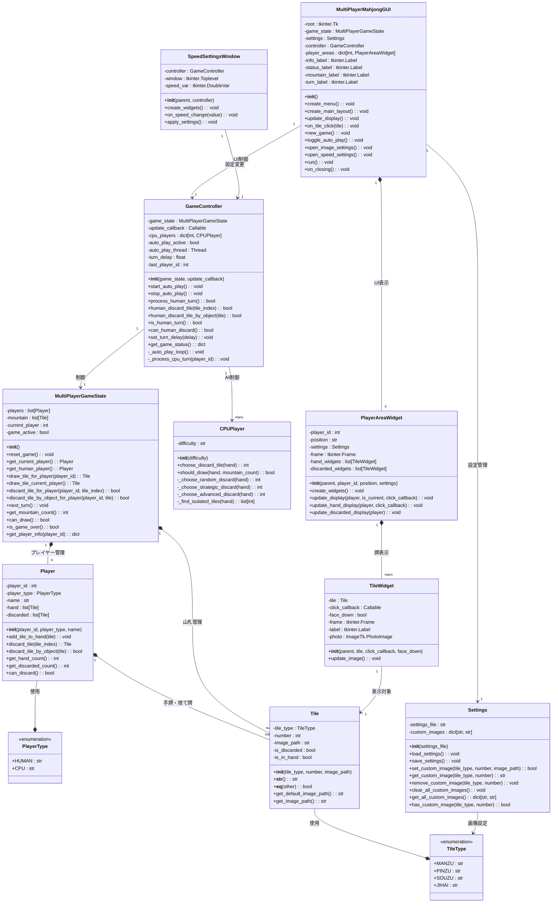
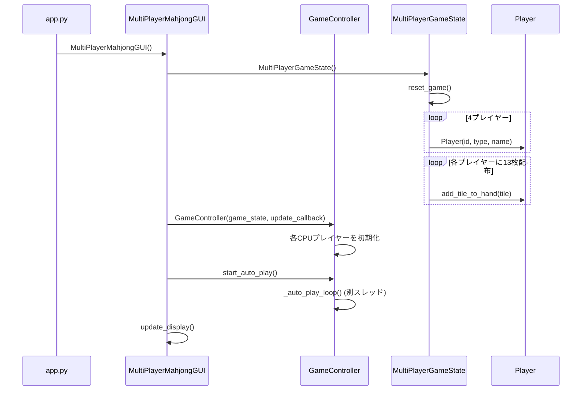
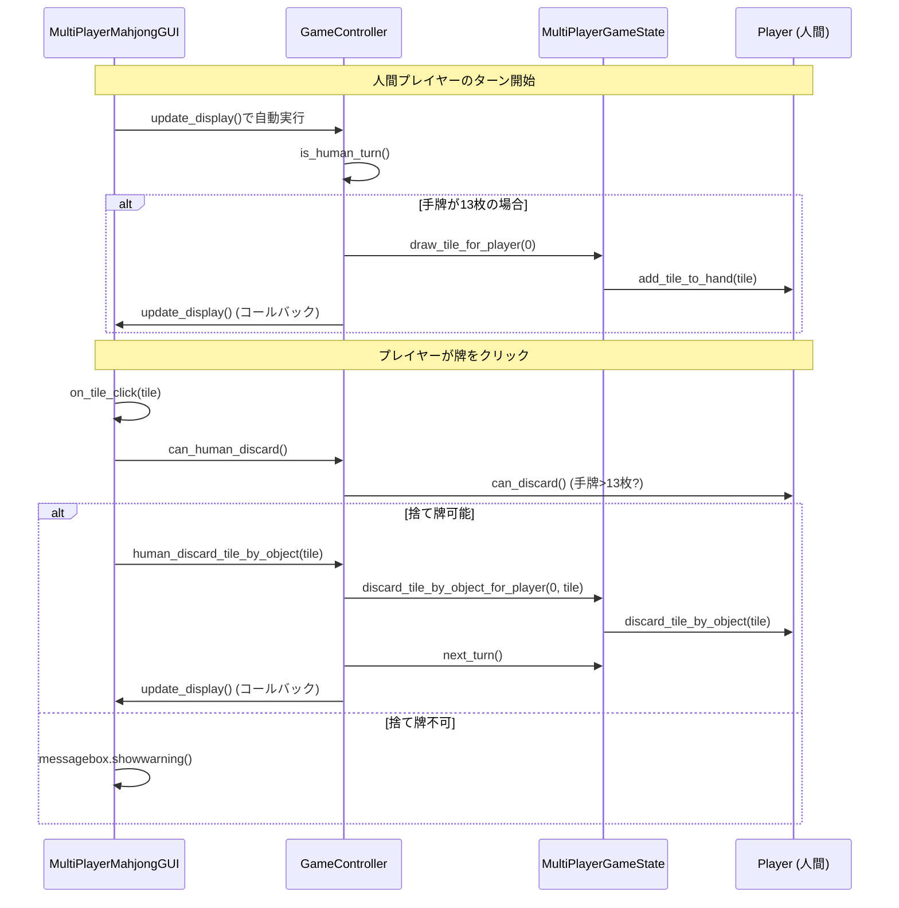
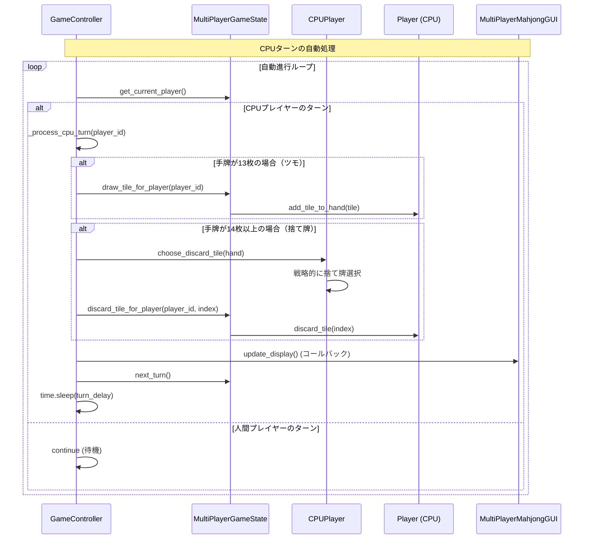
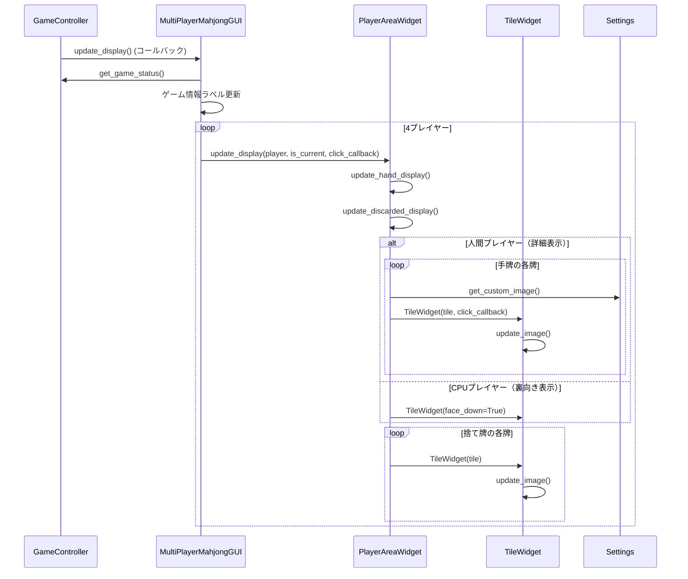

# ドンジャラアプリケーション アーキテクチャ設計図

## プロジェクト概要

ドンジャラ - 144枚の牌を使用した麻雀風ゲーム。Python (tkinter + PIL) で実装された4人対戦モード（人間1人 + CPU3人）のアプリケーション。

## クラス図

## シーケンス図

### ゲーム開始フロー

### 人間プレイヤーのターン処理

### CPUプレイヤーの自動処理フロー

### GUI更新サイクル

## アーキテクチャの特徴

### MVCパターンの採用
- **Model**: `MultiPlayerGameState`, `Player`, `Tile` - ゲームのデータと状態管理
- **View**: `MultiPlayerMahjongGUI`, `PlayerAreaWidget`, `TileWidget` - UI表示とユーザー操作
- **Controller**: `GameController` - ゲームフローの制御とModel/View間の調整

### スレッド設計
- メインスレッド: GUI描画とユーザー操作処理
- バックグラウンドスレッド: CPUプレイヤーの自動処理（`_auto_play_loop`）
- 同期機構: コールバック関数によるGUI更新の制御

### 責任分散
- **ゲームロジック**: 牌の管理、プレイヤー状態、ターン制御
- **AI処理**: CPUプレイヤーの戦略的判断
- **UI管理**: 牌の表示、プレイヤーエリア、設定ダイアログ
- **設定管理**: 画像カスタマイズ、ゲーム設定の永続化

### 拡張性
- CPUの難易度レベル調整可能
- 牌画像のカスタマイズ機能
- ゲーム設定の柔軟な変更
- 新しいゲームモードの追加が容易な設計